# LearnOpenGL (WIP)

This repository contains my implementation of the chapters from the [LearnOpenGL](https://learnopengl.com/) tutorial. Each chapter has its own directory in [src](src). Source files in [includes](includes) and [externals](externals) are shared across all chapters.

<table align="center">
  <tr>
    <td align="center">
      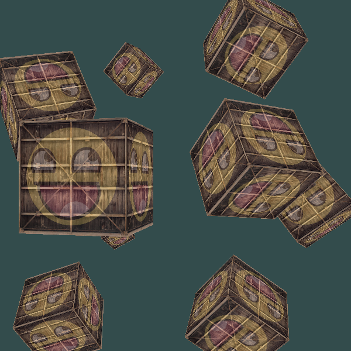
      <br>
      <strong>Camera (10)</strong>
    </td>
    <td align="center">
      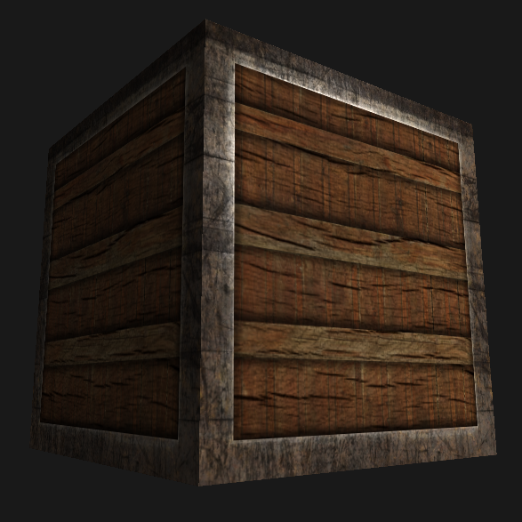
      <br>
      <strong>Ligthing maps (15)</strong>
    </td>
    <td align="center">
      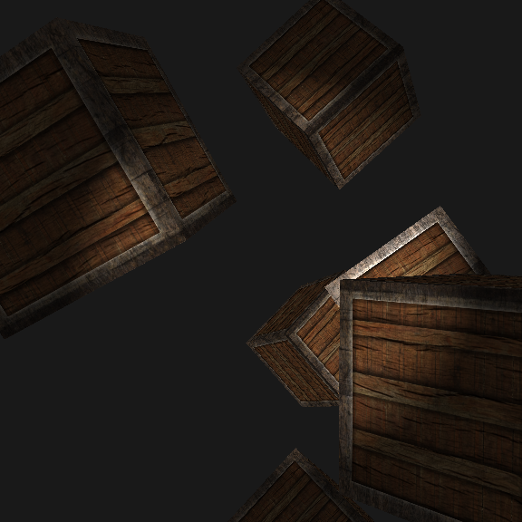
      <br>
      <strong>Light casters (16)</strong>
    </td>
  </tr>

  <tr>
    <td align="center">
      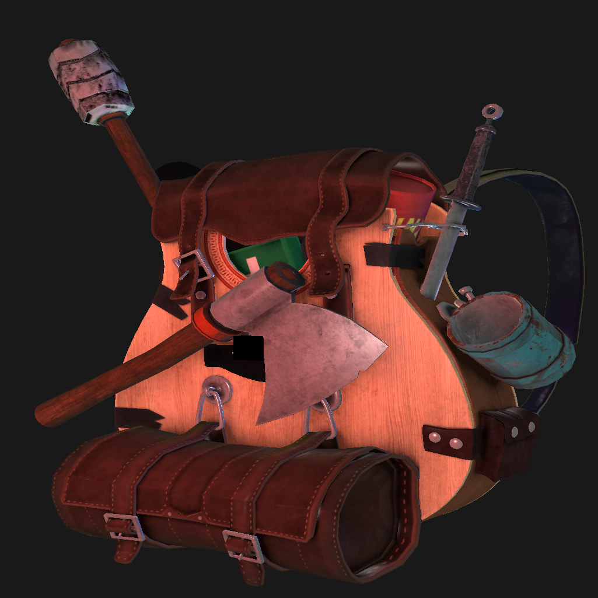
      <br>
      <strong>Mesh loading (20)</strong>
    </td>
    <td align="center">
      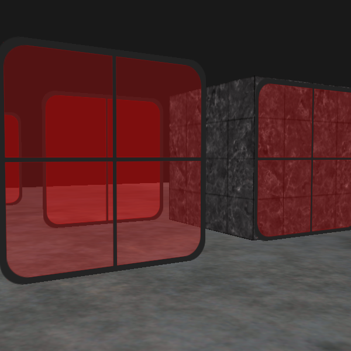
      <br>
      <strong>Blending (24)</strong>
    </td>
    <td align="center">
      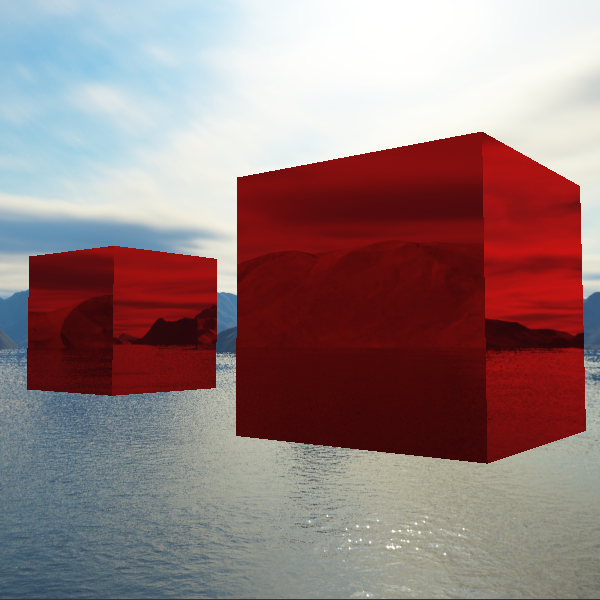
      <br>
      <strong>Cubemap (27)</strong>
    </td>
  </tr>

  <tr>
    <td align="center">
      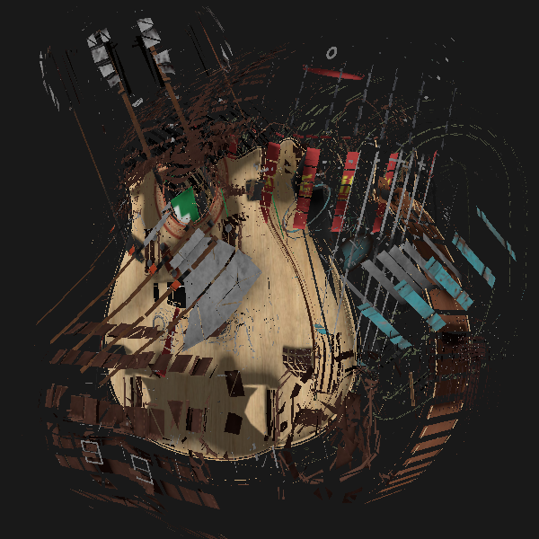
      <br>
      <strong>Geometry shader (30)</strong>
    </td>
    <td align="center">
      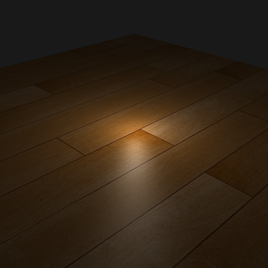
      <br>
      <strong>Advanced lighting (33)</strong>
    </td>
    <td align="center">
      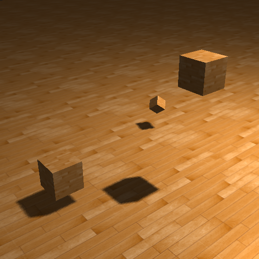
      <br>
      <strong>Shadow mapping (35)</strong>
    </td>
  </tr>

  <tr>
    <td align="center">
      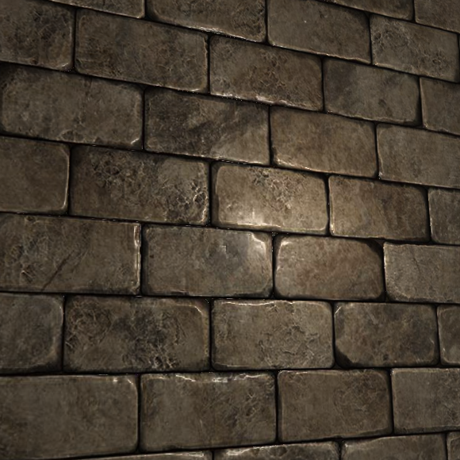
      <br>
      <strong>Normal mapping (37)</strong>
    </td>
    <td align="center">
      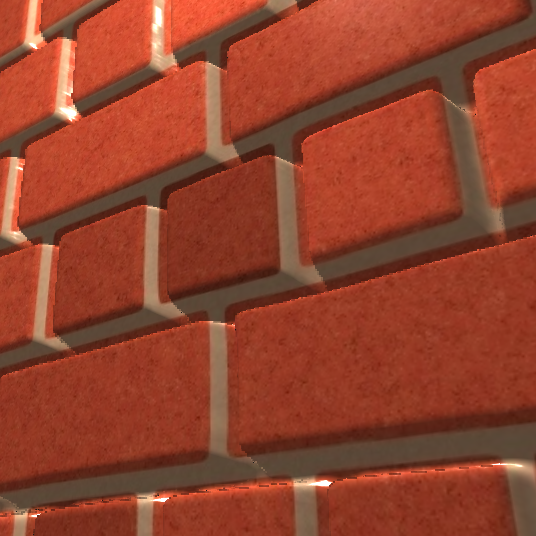
      <br>
      <strong>Parallax mapping (38)</strong>
    </td>
    <td align="center">
      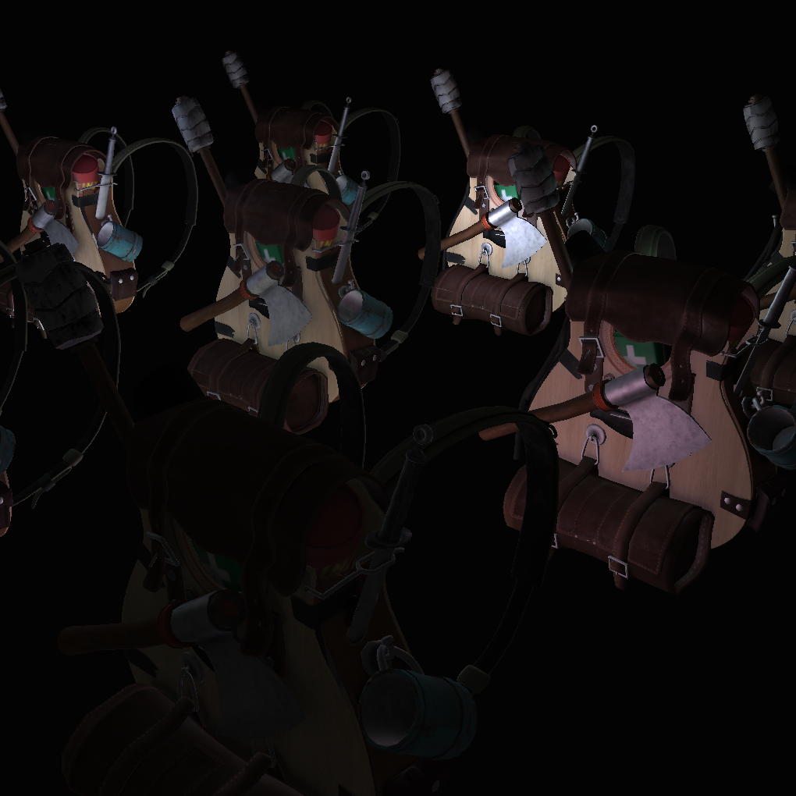
      <br>
      <strong>Deferred shading (41)</strong>
    </td>
  </tr>
</table>

### How to compile

```bash
# Run these commands from the directory of a chapter you want to execute
mkdir build
cd build
cmake ..
make
./main
```

### Requirements

+ C++17
+ CMake >= 3.10
+ GLFW 3
+ GLAD, GLM and Assimp are already included in [externals](externals)

### Controls

+ **W/A/S/D :** Move the camera forward/backward/left/right
+ **Mouse wheel :** Zoom in/out
+ **Spacebar/Left control :** Move the camera up/down
+ **Mouse :** Look around
+ **Escape :** Close the window